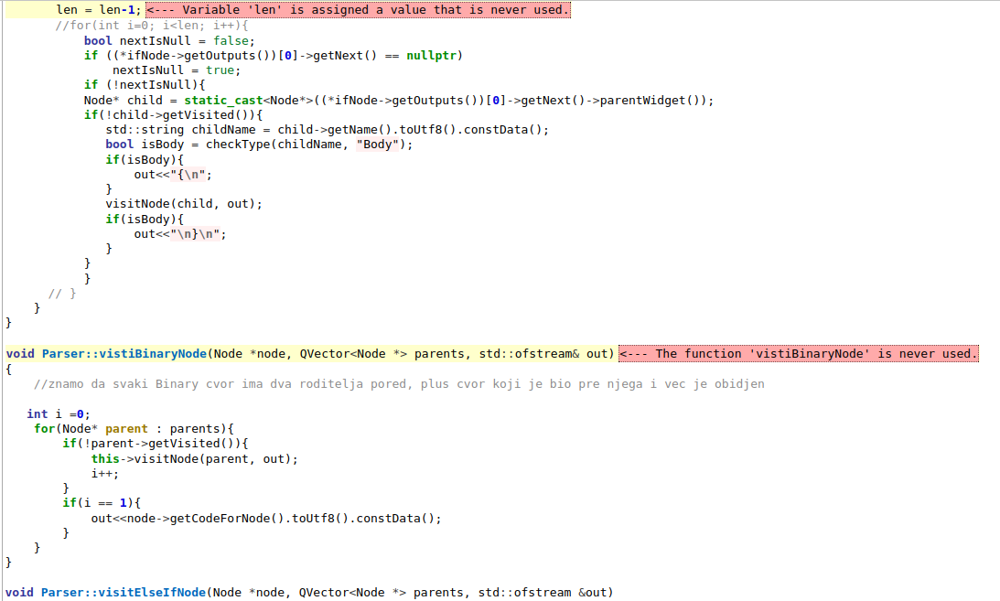

# Izveštaj sprovedene analize

Korišćeni alati:
- [Cppcheck](#cppcheck)
- [ClangFormat](#clang_format)
- [Valgrind](#valgrind)
	- [Memcheck](#memcheck)
	- [Callgrind](#callgrind)
 - [Flawfinder](#flawfinder)

## Cppcheck
Cppcheck je alat za statičku analizu C i C++ koda, čija je primarna svrha pronalaženje potencijalnih problema pre izvršavanja programa. Pruža programerima informacije o kvalitetu njihovog koda, olakšavajući proces poboljšanja. Ovaj alat je posebno koristan za otkrivanje curenja memorije, identifikaciju neinicijalizovanih promenljivih, pronalaženje potencijalnih problema sa pokazivačima, te pomaže u održavanju konzistentnosti koda.

### Postupak analize
Za cppcheck analizu korišćen je terminal a koraci pokretanja alata opisani u okviru [README.md](cppcheck/README.md).

### Zaključci
Nakon pokretanja skripta `cppcheck_xml.sh` dobijen je detaljan izveštaj u okviru kog možemo videti sva upozorenja sa tačnim mestom u kodu gde su upozorenja pronađena. Izveštaj je prikazan na slici ispod:

Jedno od upozorenja odnosi se na funkcije i promenljive koje su deklarisane ali nisu korišćene.

Takođe, vidimo da se kao upozorenje javlja postojanje konstruktora koji primaju jedan argument a nisu deklarisani ključnom rečju explicit.

Često upozorenje na koja je alat Cppcheck ukazao se tiče toga da neke izvedene klase definišu promenljive sa istim imenom koje je već definisano u roditeljskoj klasi. Ovo se često naziva **shadowing** ili **senčenje** i može dovesti do konfuzije u kodu. Da bi se izbegle potencijalne greške i konfuzija, preporučuje se izbegavanje imenovanja članova sa istim imenom u izvedenim klasama kao i u njihovim roditeljskim klasama. Umesto toga, razmislite o preimenovanju članova kako bi izbegli sukobe imena i olakšali razumevanje koda.

## ClangFormat
Clang-Format je alat koji služi za automatsko oblikovanje (formatiranje) izvornog koda u C, C++ i drugim jezicima podrˇzanim od strane Clang kompajlera. Clang-Format analizira izvorni kod i primenjuje odredena pravila formatiranja kako bi ga učinio čitljivijim i doslednijim. On nam nudi više različitih stilova formatiranja. Neki od stilova su LLVM, Google, Chromium, Mozilla, WebKit, Microsoft, GNU. Može se iskoristiti bilo koji od ovih stilova, može se kreirati sopstveni stil, a može se i iskoristiti neki već postojeci kao osnova koja se menja radi kreiranja sopstvenog stila. Za pokretanje ovog alata korišćen je skript `clangf_ormat.sh`.Na slici ispod vide se sve komande koje su korišćene.

Time se dobija fajl `.clang-format` koji se može menjati komandom **vim .clang-format** radi kreiranja sopstvenog stila. Izmene koje sam
napravila su sledeće:
- IndentWidth: 2 → 4
- TabWidth: 8 → 4
Zbog toga što ovaj alat nema opciju `run` kojom bi se odmah primenio na ceo projekat, iskoristila sam `run-clang-format.py` koja prolazi
kroz sve fajlove .hpp i .cpp i primenljuje clang-format. Naredba koju
sam pokretala u terminalu je sledeća: `python3 run-clang-format.py . file`.

## Valgrind
Valgrind je programski alat za za dinamičku analizu mašinskog koda. On omogućava automatsko otkrivanje problema sa memorijom i
procesima, što ga čini pogodnim za otkrivanje i ispravljanje grešaka u softverskim aplikacijama. Najčešće se koristi za debugovanje memorije, detekciju curenja memorije i profajliranje. U sklopu analize, koristila sam dva Valgrind alata: `Memcheck` i `Callgrind`.

## Memcheck
Alat Memcheck u okviru Valgrinda je moćan alat koji pomaže u identifikaciji curenja memorije, čitanju neinicijalizovane memorije i otkrivanju drugih grešaka povezanih s upravljanjem memorijom u programima napisanim u C i C++ jeziku. Kroz analizu izvršnih datoteka, Memcheck otkriva probleme koji mogu prouzrokovati nepredvidivo ponašanje programa, pružajući programerima detaljne informacije za poboljšanje stabilnosti i pouzdanosti koda.

Iako je moguće pokrenuti alat i iz QtCreator okruženja, Memcheck sam za analizu koristila preko terminala prateći postupak pokretanja iz [README.md](memcheck/README.md).

### Zaključci

Možemo zaključiti da je relativno mali broj blokova definitivno izgubljen u poređenju sa ukupnim brojem blokova. Većina izgubljenih blokova nije povezana sa izvornim kodom programa, već dolazi iz korišćenih biblioteka.

Jedini slučajevi gde imamo curenje memorije u izvornom kodu su sledeći:

Trebalo bi da se obezbedi da se memorija alocirana putem operatora `new` u oba ova konstruktora pravilno dealocira, recimo implementacijom destruktora u klasama `PrintNode` i `CustomGraphicsView`.
U izvornom kodu programa nemamo nedozvoljeno oslobadjanje memorije, kao ni prosledivanje neinicijalizovanih vrednosti sistemskim
pozivima.

## Callgrind
Callgrind je alat za profajliranje performansi u programiranju. On se koristi za merenje performansi programa tako što prati broj izvršenih instrukcija, keš pristupa, grananja, kao i druge metrike izvršavanja programa. Callgrind generiše detaljan izveštaj o korišćenju resursa tokom izvršavanja programa, omogućavajući programerima da identifikuju delove koda gde se troše najviše resursa, kao i da pronađu potencijalne tačke za optimizaciju. 

Callgrind sam koristila preko terminala prateći postupak pokretanja iz [README.md](callgrind/README.md).

Za tumačenje izveštaja nam služi pomoćni alat `KCachegrind` koji reprezentuje izveštaj u vizuelnom i interaktivnom formatu. 

Ono što nas zanima su funkcije koje se pozivaju najveći broj puta. Sa leve strane se nalaze informacije o broju pozivanja svake funkcije
i broju instrukcija koje je zahtevalo njeno izvršavanje, samostalno i uključujući izvršavanja drugih funkcija koje je pozivala. Na desnoj
strani možemo izabrati opciju `All Callers` i videćemo koje sve funkcije su pozivale funkciju koja nas zanima. Takodje na dnu sa desne
strane vidimo i graf poziva funkcije koji se dobija odabirom opcije `Call Graph`.
Na osnovu analize datog izveštaja, stiče se utisak da nema velikog broja poziva funkcija u delu koji je implementiran od strane programera ovog projekta.

## Flawfinder
Flawfinder je alat za statičku analizu koda koji se koristi za otkrivanje potencijalnih sigurnosnih propusta u izvornom kodu softvera
napisanog u programskom jeziku C i C++. Ovaj alat skenira izvorni kod i identifikuje delove koda koji bi mogli predstavljati sigurnosne ranjivosti, kao što su upotreba funkcija koje su poznate po svojoj ranjivosti ili nedovoljnoj validaciji korisničkih unosa. Flawfinder se zasniva na pretragama baze podataka poznatih sigurnosnih propusta i koristi liste poznatih ranjivosti kako bi identifikovao potencijalne probleme u kodu
.
Alat Flawfinder pokretan je iz terminala prateći postupak pokretanja iz [README.md](flawfinder/README.md).
detaljnije informacije o samoj grešci.
